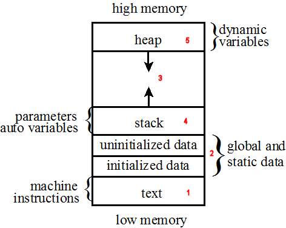
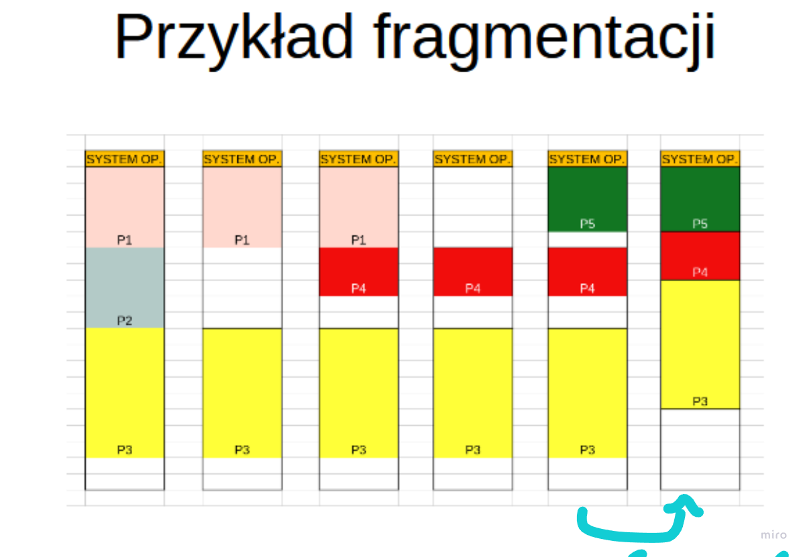
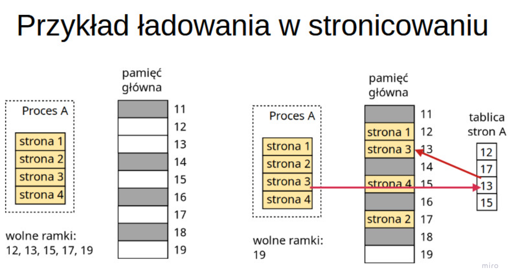
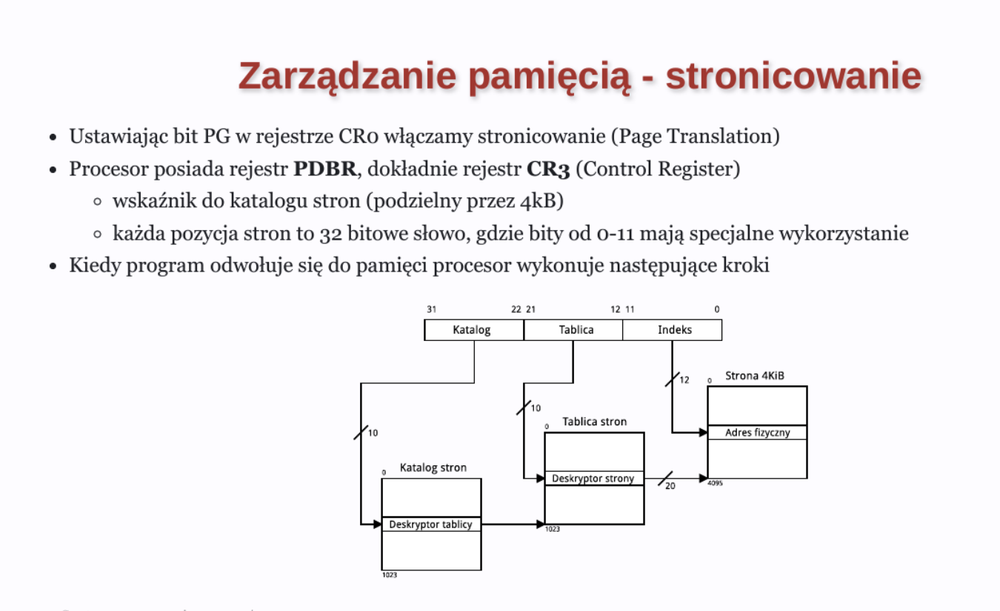

# AKISO Notes

## Wywołania systemowe
- zapewniają komunikację użytkownika z jądrem
- efektywnie wywołują funkcję jądra
- są interfejsem systemu operacyjnego


## Przerwania 
- dzielą się na sprzętowe i systemowe
- są mechanizmem używanym do przęrzucenia kontroli z programu użytkownika do jądra systemu operacyjnego

### Sprzętowe
- wywołane przez I/O devices()
- obsługiwane przez kontroler przerwań
- są asynchroniczne

### Systemowe
- wywołane przez programy użytkownika
- obsługiwane przez jądro systemu operacyjnego
- służą do realizacji funkcji systemowych lub wywołania syscalli
- są synchroniczne

### Przykłady Zastosowań
- Otwieranie i zamkykanie plików
- Odczyt i zapis danych do plików
- Alokacja i zwalnianie pamięci
- Obsługa sygnałów
- Zarządzanie procesami

### Synchroniczność
Synchroniczność oznacza, że operacje są wykonywane 
w sposób sekwencyjny, jedna po drugiej. 
Każda operacja musi zakończyć się przed rozpoczęciem kolejnej. 
W kontekście przerwań systemowych, synchroniczność oznacza, że program musi czekać na zakończenie przerwania przed kontynuowaniem swojej pracy.

### Asynchroniczność
Asynchroniczność oznacza, że operacje mogą być wykonywane równocześnie, 
bez konieczności czekania na zakończenie jednej operacji przed rozpoczęciem 
kolejnej. W kontekście przerwań sprzętowych, asynchroniczność oznacza, 
że przerwania mogą wystąpić w dowolnym momencie, niezależnie od bieżącego stanu programu, i są obsługiwane przez system operacyjny bez zatrzymywania głównego przepływu programu.

## Biblioteki dynamiczne
- są ładowane do pamięci w trakcie działania programu

## Tryby pracy procesora
### Tryb rzeczywisty(real)
- pełny dostęp brak ochrony
- konpatybilność z procesorami 8086/8088
- bespośredni dostęp do RAM
- brak wielozadaniowości
- brak stronicowania pamięci

### Tryb chroniony(protected)
- pełna ochrona pamięci
- wspiera wielozadaniowość - wiele programów może działąć jednocześnie
- prawa dostępu do pamięci Ring 0 - jądro systemu, Ring 3 - programy użytkownika
- segmentacja i stronicowanie pamięci

## Stos (Stack) i sterta (Heap): instrukcja, rejestry, pamięć

### Stos (Stack)
Stos (stack) to struktura danych, która przechowuje dane w sposób LIFO (Last In First Out).

#### Rejestry stosu
- Rejestr wskaźnika stosu (ESP) - wskaźnik na szczyt stosu
- Rejestr bazowy stosu (EBP) - wskaźnik na dno stosu

#### Instrukcje stosu
- `PUSH` - umieszcza wartość na szczycie stosu, zmniejszając wskaźnik stosu (ESP)
- `POP` - pobiera wartość ze szczytu stosu, zwiększając wskaźnik stosu (ESP)
- `CALL` - zapisuje adres powrotu na stosie i skacze do adresu funkcji
- `RET` - pobiera adres powrotu ze stosu i skacze do niego

#### Pamięć stosu
Stos jest obszarem pamięci, który jest używany do przechowywania danych lokalnych, adresów powrotu funkcji oraz parametrów funkcji. Stos rośnie w dół, co oznacza, że nowe dane są dodawane na niższe adresy pamięci.

### Sterta (Heap)
Sterta (heap) to obszar pamięci używany do dynamicznej alokacji pamięci w trakcie działania programu. W przeciwieństwie do stosu, sterta rośnie w górę.

#### Zarządzanie stertą
- **Alokacja**: Pamięć na stercie jest alokowana za pomocą funkcji takich jak `malloc` w C/C++ lub `new` w C++.
- **Dealokacja**: Pamięć na stercie jest zwalniana za pomocą funkcji takich jak `free` w C/C++ lub `delete` w C++.

#### Cechy sterty
- **Dynamiczna alokacja**: Pamięć może być alokowana i zwalniana w dowolnym momencie podczas działania programu.
- **Fragmentacja**: Sterta może ulegać fragmentacji, co może prowadzić do problemów z alokacją dużych bloków pamięci.
- **Wydajność**: Operacje na stercie są zazwyczaj wolniejsze niż operacje na stosie, ze względu na konieczność zarządzania dynamiczną alokacją pamięci.




## Procesy i wątki

### Proces
Program wykonujący się w systemie operacyjnym.
Każdy proces ma swoją własną przestrzeń adresową(pamięć wirtualną, odizolowana od innych procesów),
w której przechowywane są dane, kod programu, stos, itp.
Procesy mogą komunikować się ze sobą za pomocą pamięci współdzielonej, kolejki komunikatów, czy potoki.'

Podstawowe własności procesów:
- izolacja - każdy proces ma własną przestrzeń adresową
- wielozadaniowości - wiele procesów może działać jednocześnie
- statusy procesów - proces może być uruchomiony, gotowy, oczekujący, zakończony 

### Wątki
Wątek to podproces, który działa w ramach procesu. 
Jest określony jako sekwencje przewidzianych do wykonywania instrukcji, które są realizowane
w ramach jednego procesu. Każdy wątek ma swój włąsny stos, zestaw rejestrów, licznik programowy itd.
W ramach procesu wielowątkowego, każdy wątek działa niezależnie od innych wątków, ale współdzieli z nimi zasoby procesu, takie jak pamięć, deskryptory plików
oraz wykonuje się odzzielnie i asynchroniczne.

### Race Condition
Syutacja, w której wynik operacji zależy od kolejności wykonywania operacji przez wiele współbieżnych wątków

### Proces Zombie
- def1. Proces, który zakończył swoje działanie, ale nadal istnieje w systemie, ponieważ jego rodzic nie odebrał statusu zakończenia.
- def2. Proces, który zakończył swoje działanie, ale nadal zajmuje miejsce w tablicy procesów, nie jest w stanie zakończyć działania, ponieważ jego rodzic nie odebrał statusu zakończenia.

```c
#include <stdio.h>
#include <stdlib.h>
#include <unistd.h>
#include <sys/wait.h>

int main() {
    pid_t pid = fork();
    if (pid > 0) {
        // Proces macierzysty
        wait(NULL);
        sleep(10);
    } else if (pid == 0) {
        // Proces potomny
        exit(0);
    } else {
        // Błąd podczas tworzenia procesu
        perror("fork");
        return 1;
    }
    return 0;
}
```

## Komunikacja między procesami
Procesy mogą komunikować się ze sobą za pomocą różnych mechanizmów, takich jak:

1. Pamięć współdzielona(Shared Memory) - obszar pamięci, który jest współdzielony przez wiele procesów

2. Potoki(Pipes) - mechanizm komunikacji między procesami, który umożliwia przesyłanie danych 
 w formie strumieni między procesami
    - Potok nazwany(named Pipe) - pozwla na komunikację między procesami, które nie są spokrewnione.
    - Potok anonimowy(Anonymus Pipea) - umożliwia komunikację między procesem macierzystym i potomnym lub
    dwoma procesami w tej samej przestrzeni adresowej.

3. Sygnały(Signals) - mechanizm komunikacji między procesami, który umożliwia przesyłanie informacji o zdarzeniach
    - Sygnały są asynchroniczne, co oznacza, że mogą być wysyłane w dowolnym momencie
    - Sygnały mogą być używane do obsługi przerwań, błędów, zakończenia procesu, itp.

4. Kolejki komunikatów(Message Queues) - mechanizm komunikacji między procesami, który umożliwia przesyłanie komunikatów
Dane są przechowywane w kolejce, a procesy mogą odczytywać lub dodawać dane do kolejki.
Jak to działa: 
    - proceesy mogą wumieszczczać dane w kolejce, które mogą być odczytane później przez inne procesy
    - komunikaty są przechowywane w kolejności jakiej zostały dodane(First In First Out).

5. Gniazda(Socket) - mechanizm komunikacji między procesami, który umożliwia komunikację między procesami na 
tym samym komputerze lub na różnych maszynach. Jak to działa:
    - gniazda wysyłają dane w formie strumieni między procesami(np. tekstowych, binarnych)
    - gniazda mogą być używane do komunikacji między procesami w różnych językach programowania, systemach operacyjnych, itp.


## Systemy plików
System plików to sposób przechowywania i organizowania plików oraz danych na nośnikach pamięci, takich jak dyski twarde, SSD, czy pamięci USB. Każdy system plików ma swoje własne struktury i metody zarządzania danymi.

### FAT (File Allocation Table)
- **Opis**: FAT to jeden z najstarszych systemów plików, używany pierwotnie w systemach MS-DOS i wczesnych wersjach Windows.
- **Wersje**: FAT12, FAT16, FAT32.
- **Cechy**:
  - Prosta struktura i łatwa implementacja.
  - Ograniczenia dotyczące rozmiaru plików i partycji (np. FAT32 ma limit 4 GB na plik).
  - Szeroka kompatybilność z różnymi systemami operacyjnymi.

### NTFS (New Technology File System)
- **Opis**: NTFS to zaawansowany system plików używany w systemach operacyjnych Windows NT, 2000, XP, Vista, 7, 8, 10.
- **Cechy**:
  - Obsługa dużych plików i partycji.
  - Zaawansowane funkcje bezpieczeństwa, takie jak uprawnienia plików i szyfrowanie.
  - Obsługa dziennika (journaling), co zwiększa odporność na awarie.
  - Kompresja plików i folderów.

### ext2, ext3, ext4
- **Opis**: ext (extended file system) to rodzina systemów plików używanych w systemach operacyjnych Linux.
- **Wersje**:
  - **ext2**: Brak dziennika, prosty i wydajny.
  - **ext3**: Dodanie dziennika, co zwiększa odporność na awarie.
  - **ext4**: Obsługa większych plików i partycji, lepsza wydajność i dodatkowe funkcje, takie jak alokacja opóźniona (delayed allocation).
- **Cechy**:
  - Dobra wydajność i stabilność.
  - Obsługa dużych plików i partycji.
  - Szerokie wsparcie w systemach Linux.

### Inne systemy plików
- **HFS+ (Hierarchical File System Plus)**: Używany w systemach macOS przed wprowadzeniem APFS.
- **APFS (Apple File System)**: Nowoczesny system plików używany w systemach macOS, iOS, tvOS i watchOS.
- **Btrfs (B-tree File System)**: Nowoczesny system plików dla Linuxa, oferujący zaawansowane funkcje, takie jak migawki (snapshots) i samo-naprawa.
- **ZFS (Zettabyte File System)**: Zaawansowany system plików i menedżer woluminów, oferujący wysoką niezawodność i skalowalność.

## Stronnicowanie i segmentacja(GDT)
Służą do organizowania pamięci. Mogą działać razem lub osobno

### Segmentacja
Dzielenie pamięci na segmenty(kawałki) o różnych rozmiarach i dostępach
- każdy segment ma swój adres bazowy i długość

Problem Fragmentacja


### Stronnicowanie
Dzielenie pamięci na strony o stałym rozmiarze( 4kb)
- pamięci fizyczna RAM dzielona na ramki
- Dzielimy program na strony o stałym rozmiarze
- wszystko trzymamy w tablicy stron(mapa, page table)

#### Zarządzanie pamięcią

.png>)

### GDT (Global Descriptor Table)
GDT (Global Descriptor Table) to struktura danych używana przez procesory x86 do zarządzania segmentacją pamięci. GDT przechowuje deskryptory segmentów, które definiują różne segmenty pamięci używane przez system operacyjny i aplikacje.

###$ MMU (Memory Management Unit)
MMU (Memory Management Unit) to jednostka w procesorze, która zarządza pamięcią wirtualną i tłumaczy adresy wirtualne na adresy fizyczne. MMU wykonuje stronnicowanie pamięci, zarządza TLB, kontroluje dostęp do pamięci, itp.

#### Struktura GDT
GDT składa się z tablicy deskryptorów segmentów. Każdy deskryptor segmentu zawiera informacje o bazie segmentu, jego długości oraz prawach dostępu.

#### Deskryptor segmentu
Deskryptor segmentu to 8-bajtowa struktura, która zawiera następujące pola:
- **Base Address**: Adres bazowy segmentu.
- **Limit**: Rozmiar segmentu.
- **Access Byte**: Określa prawa dostępu do segmentu (np. czy segment jest kodem, danymi, czy jest dostępny do zapisu).
- **Flags**: Dodatkowe flagi, takie jak granularity (czy limit jest w bajtach czy w jednostkach 4KB) i size (czy segment jest 16-bitowy czy 32-bitowy).

## Realizacja pamięci wirtualnej
Pamięć wirtualna to technika zarządzania pamięcią, która umożliwia programom korzystanie z większej ilości pamięci, niż jest dostępna fizycznie. Pamięć wirtualna jest podzielona na strony o stałym rozmiarze (np. 4KB), które są mapowane na ramki pamięci fizycznej w pamięci RAM.

### Pamięć Cache (L1, L2, L3)
Pamięć cache to szybka pamięć podręczna, która jest używana do przechowywania często używanych danych i instrukcji, aby przyspieszyć dostęp do nich przez procesor. Pamięć cache jest hierarchicznie podzielona na poziomy (L1, L2, L3), gdzie każdy kolejny poziom jest większy, ale wolniejszy.

#### L1 Cache
- **Lokalizacja**: Bezpośrednio w rdzeniu procesora.
- **Rozmiar**: Najmniejsza (zazwyczaj od 16 KB do 64 KB).
- **Szybkość**: Najszybsza, ponieważ jest najbliżej rdzenia procesora.
- **Podział**: Często podzielona na cache instrukcji (I-cache) i cache danych (D-cache).

#### L2 Cache
- **Lokalizacja**: Może być w rdzeniu procesora lub blisko niego.
- **Rozmiar**: Średnia (zazwyczaj od 256 KB do 1 MB).
- **Szybkość**: Wolniejsza niż L1, ale szybsza niż L3.
- **Podział**: Może być wspólna dla instrukcji i danych lub podzielona.

#### L3 Cache
- **Lokalizacja**: Zazwyczaj poza rdzeniem procesora, ale w obrębie układu procesora.
- **Rozmiar**: Największa (zazwyczaj od 2 MB do 32 MB lub więcej).
- **Szybkość**: Najwolniejsza z pamięci cache, ale nadal znacznie szybsza niż pamięć RAM.
- **Podział**: Wspólna dla wszystkich rdzeni procesora.

#### Działanie pamięci cache
1. **Hit**: Gdy procesor znajduje potrzebne dane w pamięci cache, jest to nazywane "cache hit". Dostęp do danych jest wtedy bardzo szybki.
2. **Miss**: Gdy procesor nie znajduje potrzebnych danych w pamięci cache, jest to nazywane "cache miss". Procesor musi wtedy pobrać dane z wolniejszej pamięci (np. RAM), co zwiększa opóźnienie.

#### Przykład hierarchii pamięci cache
```plaintext
+------------------+
|      L1 Cache    | <- Najmniejsza, najszybsza
+------------------+
|      L2 Cache    | <- Średnia, średnia szybkość
+------------------+
|      L3 Cache    | <- Największa, najwolniejsza
+------------------+
|      RAM         | <- Wolniejsza niż cache, większa
+------------------+
|      Dysk        | <- Najwolniejsza, największa
+------------------+
```
.png>)

## Pamięć logiczna i fizyczna

### Pamięć logiczna(wirtualna)
to abstrakcyjna przestrzeń adresowa, w której programy przechowują dane i instrukcje. Adresy w pamięci logicznej są generowane przez procesor i przetłumaczane na adresy fizyczne przez MMU (Memory Management Unit).

### Pamięć fizyczna
to rzeczywista pamięć RAM, w której dane są przechowywane fizycznie. Adresy w pamięci fizycznej odpowiadają rzeczywistym adresom komórek pamięci w pamięci RAM.

### TLB (Translation Lookaside Buffer)
TLB (Translation Lookaside Buffer) to mały, szybki bufor pamięci podręcznej używany w procesorach do przechowywania informacji o tłumaczeniach adresów wirtualnych na adresy fizyczne. TLB przyspiesza dostęp do pamięci, eliminując konieczność przeszukiwania tablic stron w pamięci RAM.

## Rejestry i Flagi
Rejestry to małe obszary pamięci w procesorze, które służą do przechowywania danych tymczasowych, adresów, wyników obliczeń, itp. Procesory x86 mają wiele różnych rodzajów rejestrów, takich jak ogólnego przeznaczenia, indeksowe, segmentowe, itp.
### Rejestry ogólnego przeznaczenia
- **EAX**: Akumulator(mnożenie, dzielenie)
- **ECX**: Licznik pętli(counter)
- **ESP**: Wskaźnik stosu(stack pointer)
- **ESI, EDI**: Rejestry źródłowe i celu dla operacji przesunięcia i kopiowania
- **EBP**: Wskaźnik ramki stosu(base pointer)

### Rejestry segmentowe
- **CS**: Segment kodu
- **DS**: Segment danych
- **SS**: Segment stosu
- **ES, FS, GS**: Dodatkowe segmenty

### Rozkazy arytmetyczne
- **ADD**: Dodawanie
- **SUB**: Odejmowanie
- **MUL**: Mnożenie
-**IMUL**: Mnożenie ze znakiem
- **DIV**: Dzielenie
- **IDIV**: Dzielenie ze znakiem
- **INC**: Inkrementacja
- **DEC**: Dekrementacja

### Rozkazy logiczne
- **AND**: I logiczne
- **OR**: Lub logiczne
- **XOR**: XOR logiczne
- **NOT**: Negacja
- **SHL, SHR**: Przesunięcie bitowe w lewo/prawo

### Rozkazy skoku
- **JMP**: Skok bezwarunkowy
- **JE, JNE**: Skok warunkowy (równy, różny)
- **JZ, JNZ**: Skok warunkowy (zero, niezero)
- **CALL**: Wywołanie procedury
- **RET**: Powrót z procedury

### Flagi
Flagi to rejestry, które przechowują informacje o wynikach operacji arytmetycznych i logicznych. Najważniejsze flagi to:
- **OF (Overflow Flag)**: Flaga przepełnienia
  - Ustawiana, gdy wynik operacji arytmetycznej przekracza zakres reprezentacji liczby w systemie dwójkowym (np. dodanie dwóch liczb dodatnich daje wynik ujemny).
  
- **ZF (Zero Flag)**: Flaga zera
  - Ustawiana, gdy wynik operacji arytmetycznej lub logicznej jest równy zero.
  
- **SF (Sign Flag)**: Flaga znaku
  - Ustawiana, gdy wynik operacji arytmetycznej lub logicznej jest liczbą ujemną (najbardziej znaczący bit wyniku jest ustawiony).
  
- **CF (Carry Flag)**: Flaga przeniesienia
  - Ustawiana, gdy operacja arytmetyczna generuje przeniesienie z najbardziej znaczącego bitu (dla operacji dodawania) lub pożyczkę do najbardziej znaczącego bitu (dla operacji odejmowania).

### Instrukcje flag
- **CLC (Clear Carry Flag)**: Wyczyść flagę przeniesienia (CF = 0)
- **STC (Set Carry Flag)**: Ustaw flagę przeniesienia (CF = 1)
- **CMC (Complement Carry Flag)**: Negacja flagi przeniesienia (CF = ~CF)
- **CLD (Clear Direction Flag)**: Wyczyść flagę kierunku (DF = 0)
- **STD (Set Direction Flag)**: Ustaw flagę kierunku (DF = 1)
- **CLI (Clear Interrupt Flag)**: Wyczyść flagę przerwań (IF = 0)
- **STI (Set Interrupt Flag)**: Ustaw flagę przerwań (IF = 1)

### TLB (Translation Lookaside Buffer)
TLB (Translation Lookaside Buffer) to mały, szybki bufor pamięci podręcznej używany w procesorach do przechowywania informacji o tłumaczeniach adresów wirtualnych na adresy fizyczne. TLB przyspiesza dostęp do pamięci, eliminując konieczność przeszukiwania tablic stron w pamięci RAM.

### SIMD (Single Instruction, Multiple Data)
SIMD (Single Instruction, Multiple Data) to technika przetwarzania danych, w której jedna instrukcja jest wykonywana na wielu danych jednocześnie. SIMD jest używany do przyspieszenia obliczeń numerycznych, grafiki komputerowej, przetwarzania sygnałów, itp.

### MIMD (Multiple Instruction, Multiple Data)
MIMD (Multiple Instruction, Multiple Data) to technika przetwarzania danych, w której wiele instrukcji jest wykonywanych na wielu danych jednocześnie. MIMD jest używany w systemach wieloprocesorowych, klastrach, gridach obliczeniowych, itp.


## Zmienne i typy danych
### 32-bitowe typy danych
- **char**: 1 bajt, -128 do 127 lub 0 do 255
- **short**: 2 bajty, -32,768 do 32,767
- **int**: 4 bajty, -2,147,483,648 do 2,147,483,647
- **long**: 4 bajty, -2,147,483,648 do 2,147,483,647
- **long long**: 8 bajtów, -9,223,372,036,854,775,808 do 9,223,372,036,854,775,807
- **float**: 4 bajty, 7 cyfr znaczących
- **double**: 8 bajtów, 15 cyfr znaczących
- **long double**: 10 bajtów, 19 cyfr znaczących

### 64-bitowe typy danych
- **char**: 2 bajty
- **short**: 4 bajty
- **int**: 8 bajtów
- **long**: 8 bajtów
- **long long**: 16 bajtów
- **float**: 8 bajty
- **double**: 16 bajtów
- **long double**: 16 bajtów
